## 前言

在很多项目中，埋点数据使用表格来统计的，随着项目的进行，数据量越来越复杂，越来越难以维护。所以很多公司都已经开发了一整套系统，从埋点的录入到代码的输出。由于很多时候一套系统对于一个小项目来说太过于复杂了，所以这里我做了一个轻量级的本地管理客户端。

## 功能简介

#### 启动

由于我们实现的是一套本地管理的系统，所以我把程序系统和数据分开了，所以启动的时候需要选择对应的数据目录，比如本项目目录下的`/demo-data/`，以微信为例。关于目录下文件功能格式会在之后说明。

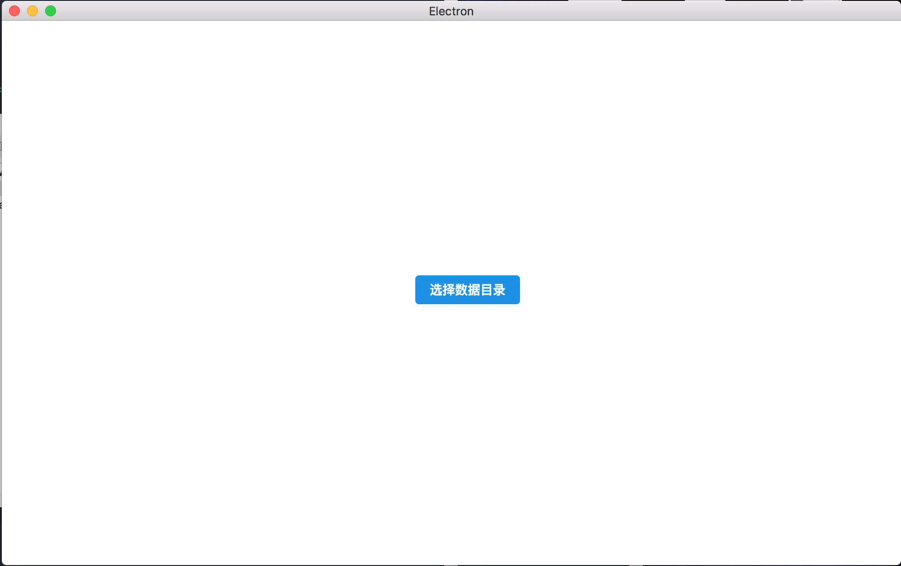

#### 主界面

启动之后，我们可以看到我们的埋点数据界面，这里我根据我们的需求把数据分为3类：

* 事件-数据点
* 页面
* 具体参数

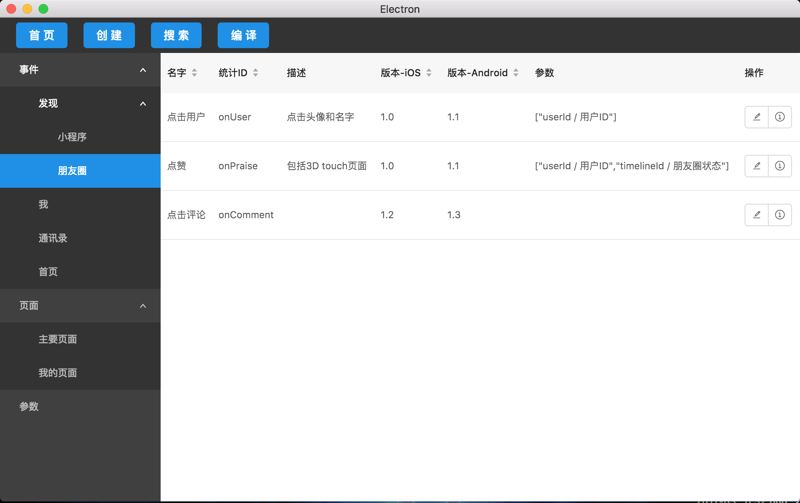

数据点包含所有埋点信息，参数是由参数列表选择，可以查看历史和进行编辑。

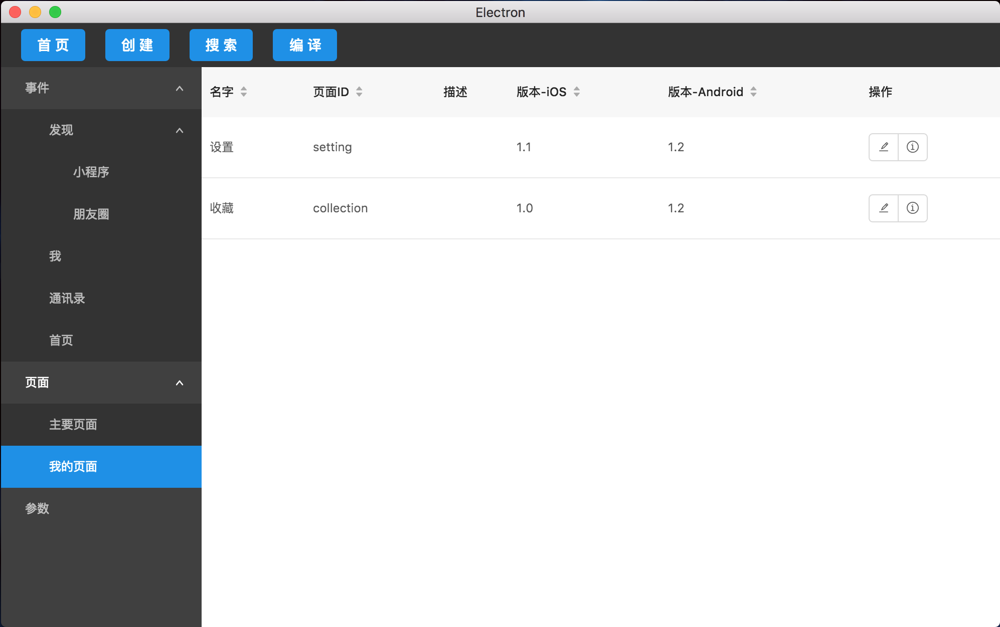

页面包含了我们的所有页面id，因为一个普通的App拥有的页面不会有太多，所以页面的分级可以少一点。

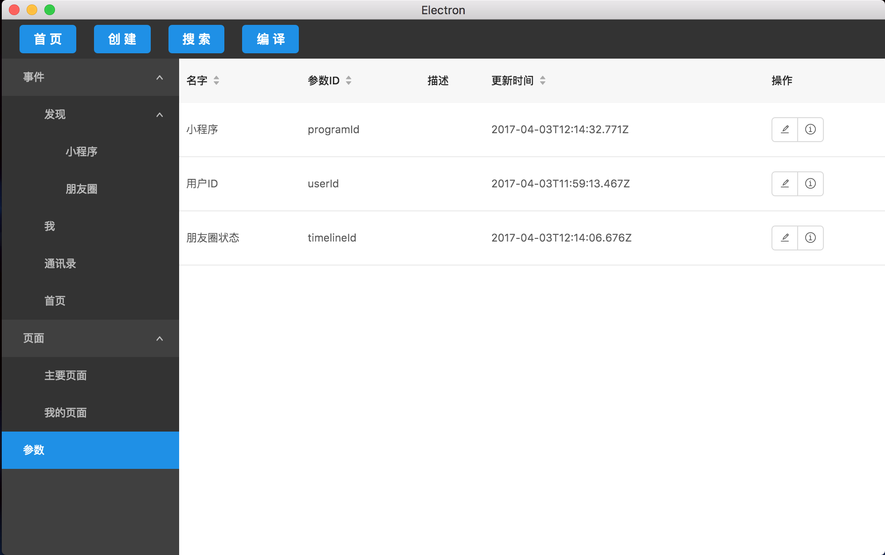

参数包含了我们埋点过程中所有遇到的参数，考虑到我们项目中所涉及到的参数比较统一，所以就没有进行分类

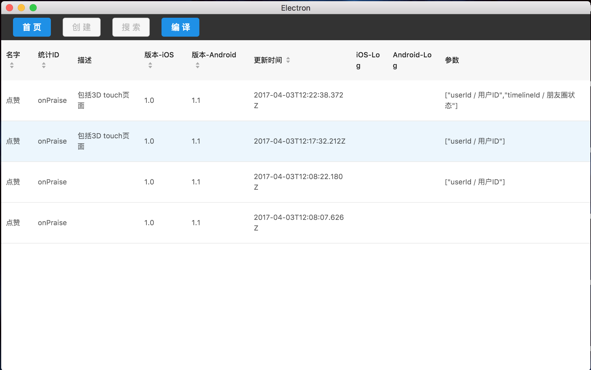

每行数据的每次改动都会形成一条记录保存在本地，这样我们就可以追溯历史变更了。这里还把所有参数都列了出来，而不是主页面精简后的了。由于性能问题，这里暂时只显示了最近50条记录。

以上所有列表的数据项都是动态可配的。在设计之初，考虑到数据内容可能会根据需要动态调整，所以把所有内容都设计为动态可配的了，又为了在磁盘上的数据的可读性，把所有数据都采用文本json保存，这样也兼容了动态的数据，具体实现后面会详细讲解。

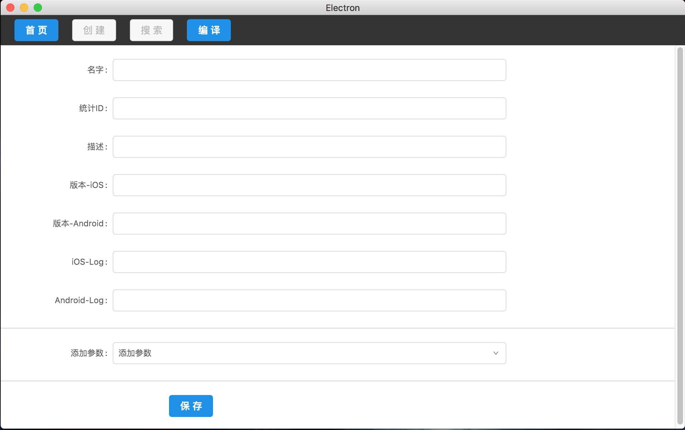

当选择了一个目录后，点击导航栏的创建可以创建一条新的数据，数据格式内容根据`根目录`属性配置。

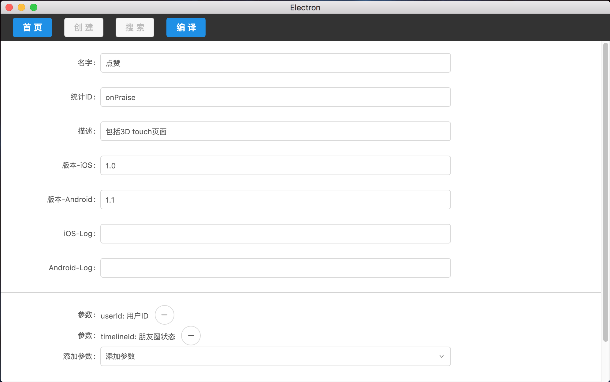

点击一行列表后的编辑按钮进入编辑页面，每次保存都会产生一条修改记录。

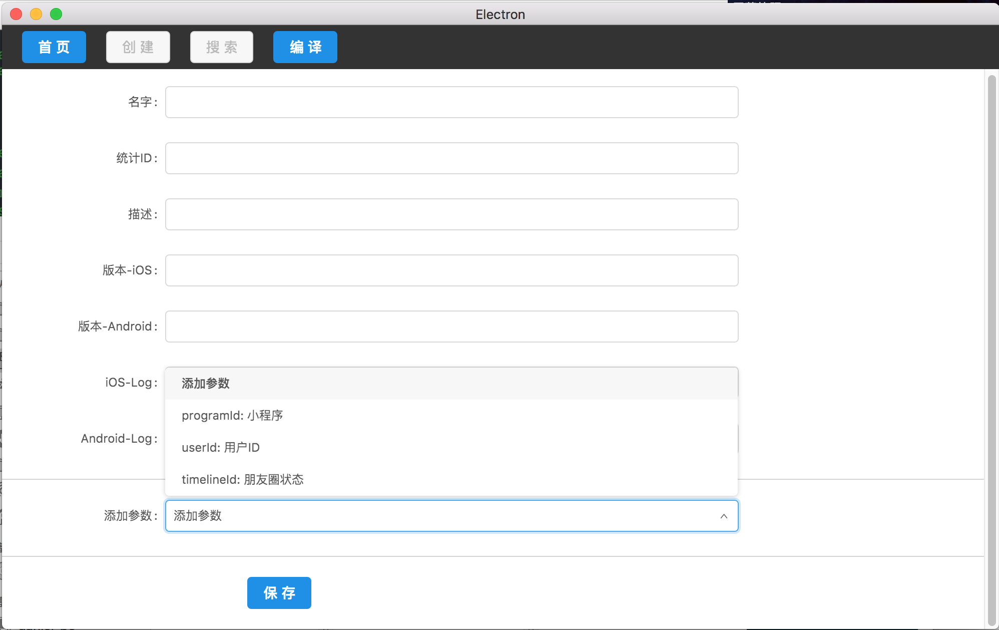

可选的参数为在根目录为`参数`内的所有内容，这样设计的原因是为了未来可能对埋点数据的自动化验证，从而需要一个格式化的参数列表，而不是一段文字描述。

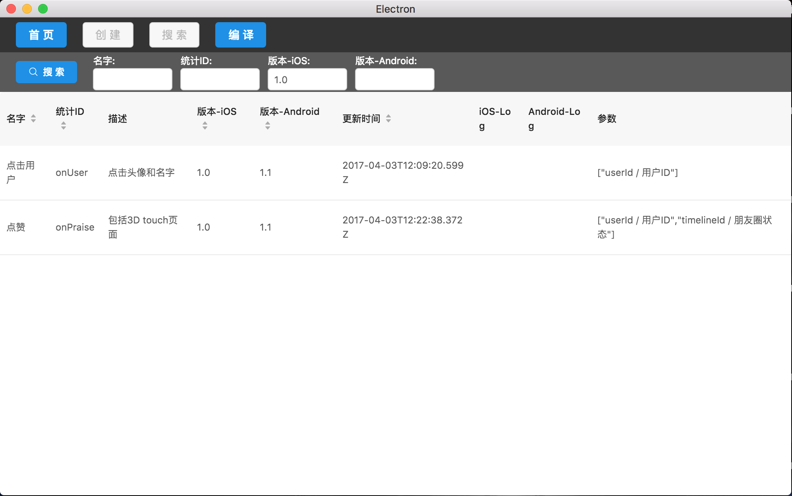

为了可以对埋点的整理归类，所以做了简单的搜索功能，可搜索字段也是根据事件目录的配置。

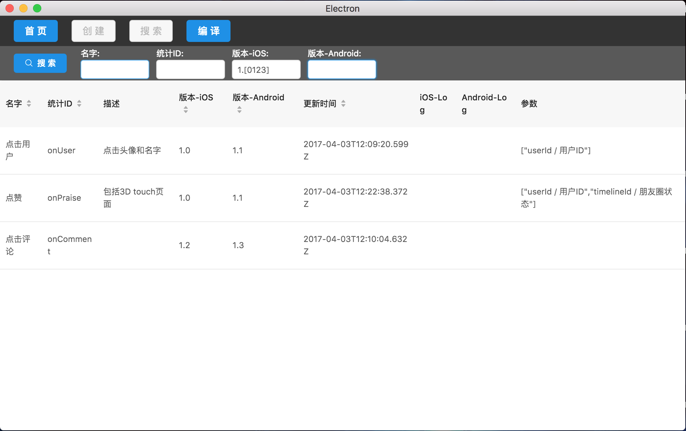

所有搜索字段都是使用正则表达式完成，所以如果需要更复杂精确的匹配，这里也可以输入一段正则来匹配。

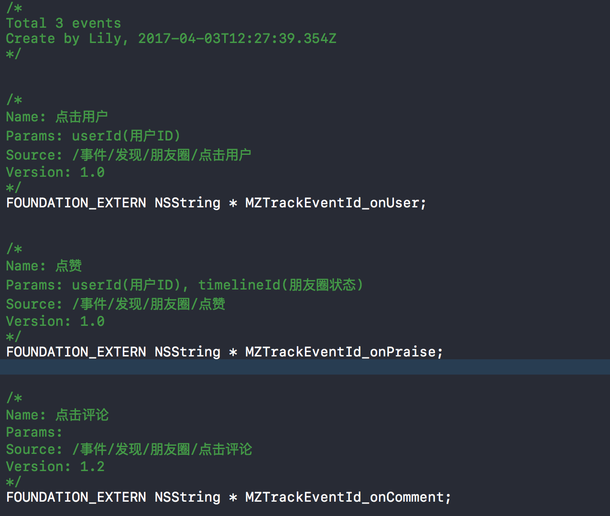

点击编译，会把所有事件和页面数据自动生成一份代码，这里是根据需要定制的，所以我只做了iOS的一个样例格式。这里我们从老数据转化过来的时候有重复埋点，所以在转化的逻辑中加入了去重，关于自定义和接入编译系统之后会详细描述。

## 进阶--配置参数

以`demo-data`数据配置为例。

#### 数据分类

在所有的数据中，概念都是节点`Node`，根据功能分为两类：

* 目录节点`DirNode`，负责分级和归类。
* 数据节点`StatNode`，负责记录每个数据的具体内容。

#### 文件持久化实现

所有数据持久化通过json格式保存为文本文件，所以可以直接查看文件内容。

按照层级结构创建一样的目录层级结构，每个`DirNode`下面都有一个`config.json`文件，包含该节点信息。

在最底层每个`StatNode`会产生一个目录，目录下会根据历史生成`1.json`，`2.json`，`3.json`名字依次递增的文件，保存每次修改后的数据。这里目录名字使用`id`来命名是为了解决数据埋点id可能存在重名的问题。

只能在目录的最底层可以创建数据，这是为了解决展示时候的难以同时展示数据和目录的问题。

#### 文件持久化格式

每个文件中都需要具备一些基础属性：

* `name`外部显示的名字，对于目录节点则是目录名字
* `id`要求唯一的id，由于`DirNode`个数比较少，而且固定，所以没有设计创建的功能，自己修改时需要保证唯一。数据节点则会生成一个MD5来填充。
* `isDirectory`表示是否是`DirNode`

#### 目录节点格式

包含一个`columns`数组，这是一个非常重要的配置，除了基础属性，所有`StatNode`里的数据项都是根据该字段动态生成。

这里是一个事件节点例子：

```json
[
	{
      "type": "text",			// 字段类型（暂时只支持text和param）
      "required": false,		// 是否必填

      "title": "描述",			// 展示的列名
      "key": "description",  	// 对应于json中的key值
      "visible": true,			// 在主界面是否隐藏
      "editable": true,			// 是否可编辑，在编辑和创建界面是否可见
      "searchable": true		// 是否可以作为搜索参数，影响搜索界面
    },
    {
      "type": "params",
      "paramsKey": "params",	// 如果是param类型，需要指定`DirNode`的id
      "required": false,

      "title": "参数",
      "dataIndex": "params",
      "key": "params",
      "visible": true,
      "editable": true,
      "searchable": false
    }
]
```

可以动态增加或者修改数据项，这样会非常灵活而且可以不通过修改代码就配置数据内容。

节点间的`columns`是可以被继承的，也就是说子目录的`columns`必定包含父目录的所有数据内容。可惜目前的使用场景并没有这个要求。

所有其他目录的配置都是类似的。

#### 数据节点格式

同样看一个例子

```json
{
    "name": "点赞",
    "statId": "onPraise",
    "description": "包括3D touch页面",
    "version_iOS": "1.0",
    "version_Android": "1.1",
    "createTime": "2017-04-03T12:22:38.372Z",
    "params": [
        {
            "name": "用户ID",
            "description": "",
            "createTime": "2017-04-03T11:59:13.467Z",
            "isDirectory": false,
            "id": "814db1c837ac436ebb569d3554b51fb1",
            "paramId": "userId"
        },
        {
            "name": "朋友圈状态",
            "createTime": "2017-04-03T12:14:06.676Z",
            "isDirectory": false,
            "id": "866982e498224b15aa4602f2893f7995",
            "paramId": "timelineId"
        }
    ],
    "isDirectory": false,
    "id": "9b538d5bee1c40ed979e5a38143a9829"
}
```

所有数据都是根据上述配置生成，其中param比较特殊，是把选择的数据节点直接拷贝了一份，这样做的原因是怕其他地方修改或者删除了导致数据不一致的问题，这样做更符合埋点这个需求。

## 接入编译系统

目前编译系统还是做在了代码中，由于系统本身是有NodeJS实现的，所以要动态配置编译系统还是非常简单的。

编译系统比较开放，这样可以开放更多的功能，但同时也引入了数据风险，之后需要改进下，让编译系统可以动态接入，并且屏蔽内部数据和编译系统的直接联系。

目前代码放在`/script`目录下。

## 开发者

这里对整个系统的代码逻辑进行说明。

#### 设计理念

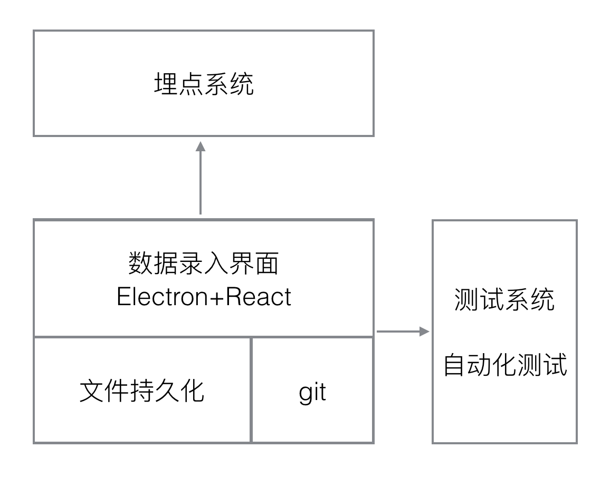

最基本的功能，需要能够在团队内共享数据，其中最方便的就是利用git系统了，所以在每次修改数据的时候除了本地持久化以外，会自动同步git上的数据文件，这也是为什么要数据分离的一个原因。

如果能够接上埋点系统，那么可以通过该系统去分析结果，这个工作量可能会比较大，是一个设想。

如果能够接上自动化测试或者设备，就能够验证埋点数据是否正确，这个的工作量也可能会比较大。

目前完成了最基础的管理埋点和生成代码功能。

#### 运行环境

nodejs

Mac可以通过`brew install nodejs`来安装

需要electron和webpack

```
npm install -g electron webpack
```

#### 运行代码

首先`npm install`

然后需要链接本地库

```
cd dd-stat
npm link
cd ../stat
npm link dd-stat
```

最后

```
npm run dev	#开启webpack -w
npm run app	#启动应用
```

#### 代码简介

`dd-stat`是系统的数据层，包含了数据结构和持久化。

`stat`是界面层，为了实现简单，目前所有逻辑都是在渲染层做的，因为我们的数据量按照我们的需求是不太可能达到如此大的数目，是不太可能出现性能问题的。

`stat`依赖支付宝的`ant design`框架来搭建，最初是用`redux`来组织(`/lib`)，后来发现太过于复杂，应用本身就是个简单的场景，所以后来改为`react-router`来组织(`/lib2`)。

`/script`是数据编译的代码，是导出编译后代码或者导出其他格式的一个出口，可以根据需要扩展。


## TODO

#### git接入

现在已经默认接入git，但是当不是一个git仓库时会报错误，以后需要改进支持选择性接入git。

<del>
最初的想法是让程序来自动同步`git`，因为应用的使用场景比较简单，不太可能出现多人同时编辑同一个数据的问题，所以让程序来自动同步数据是最好的，由于时间问题，暂时没有加入。
</del>

#### 编译系统完善

现在编译系统采用ejs模板引擎实现。现在默认了iOS和scv编译输出，可自行选择修改。

<del>
现在编译系统是和应用代码捆绑在一起的，最好能够脱离代码，并且可以动态配置编译模板。
</del>

#### 更多可配的数据类型

增加对bool，枚举单选，枚举多选，时间等的支持，项目暂时还没有这样的需求。
